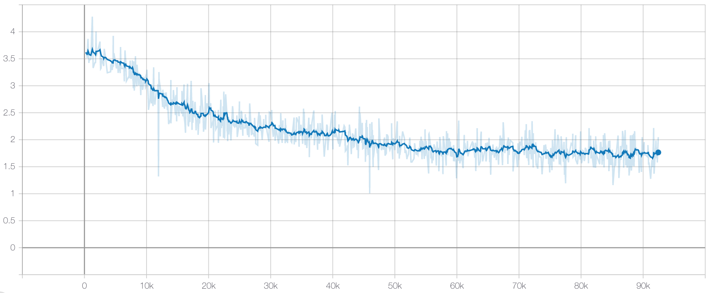

# Music-GPT-2
### Music GPT-2 Implementation with Relative Positional Embedding

This project is an implementation of Music Transformer(https://arxiv.org/abs/1809.04281) using GPT-2.

The GPT-2 source code was used from the link below. 
https://github.com/openai/gpt-2

The difference with the GPT-2 source is that this used only decoder and relative position embedding.

## Pre-requisites
1. pip3 install tensorflow Note: This is on version 2
2. pip3 install numpy==1.19.5 Note: There is a bug with the later version, switch to latest when this is resolved.
3. pip3 install librosa
4. pip3 install tensorboardX
5. pip3 install tqdm
6. pip3 install python3-midi https://github.com/louisabraham/python3-midi
7. Jupyter notebooks also needs to be installed.

## Preprocessing
1. Download and extract Maestro dataset V.3.0.0 from the following link
https://magenta.tensorflow.org/datasets/maestro

2. jupyter notebook preprocessing.ipynb to launch the notebook 
By default, the notebook assumes the dataset is stored in the local directory. Modify maestro_dir into your own maestro dataset path in the file. The files will be processed and written to ./dataset

## Training

1. Modify the data_dirs and load_dir, save_dir. 
data_dirs: the directories to load preprocessed data files 
load_dir: the directory to load a model 
save_dir: the directory to save a model

2. jupyter notebook Music-GPT-2.ipynb to launch the notebook
you can increase the batch size by changing batch_size variable.

## Inference

Run 'Output MIDI file' cell in Music-GPT-2.ipynb to make a new MIDI file.
You should input load_dir, and variable N means the sequence length of what you want to make. It should be greater than the hyper-parameter n_time.

## Loss

## Samples
Three samples created by Music-GPT-2 
https://soundcloud.com/hutenheum/sets/three-musical-moments-by-gpt-2
 

